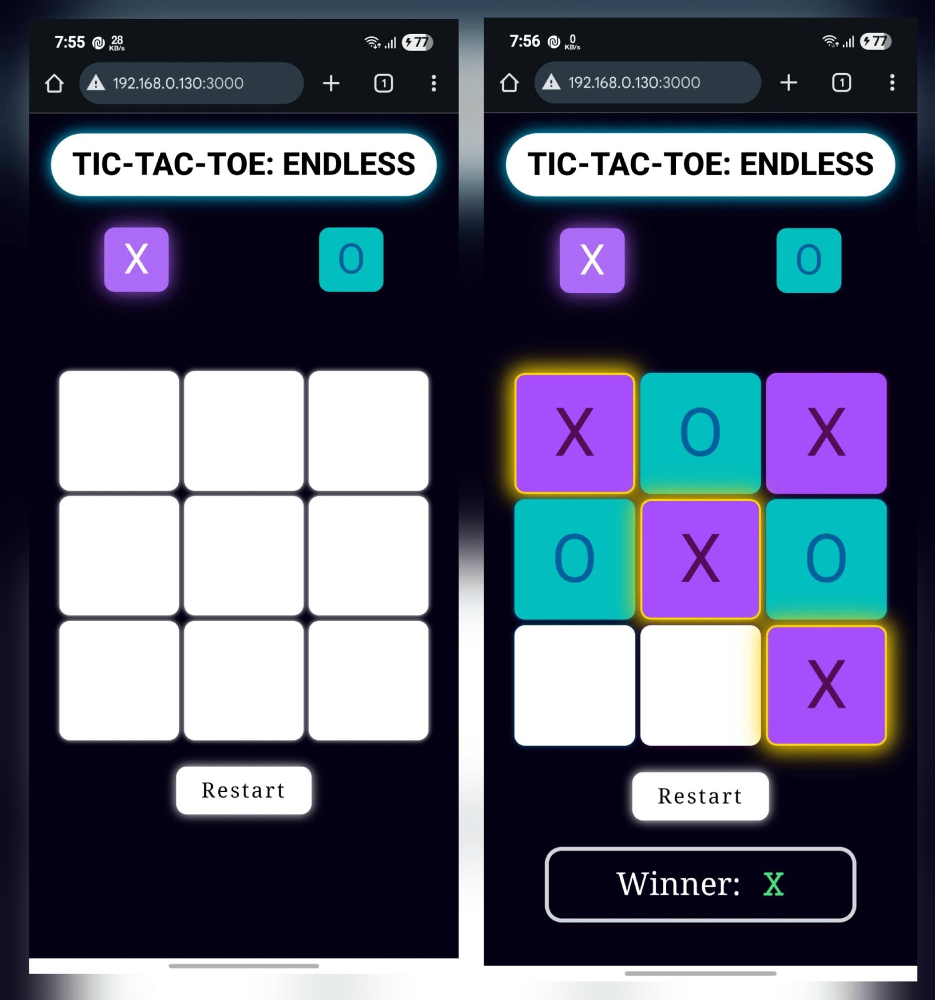

# Tic-Tac-Toe: Endless ♾️

An innovative twist on the classic Tic-Tac-Toe game that eliminates draws and creates endless strategic gameplay through a unique queue-based mechanism.

## 🎮 What Makes It Special?

Unlike traditional Tic-Tac-Toe where games often end in draws, **Tic-Tac-Toe: Endless** implements a revolutionary queue system that ensures every game has a winner while adding layers of strategy and prediction.

### Key Innovation: The Infinity Queue
- **Queue Length**: 7 symbols maximum on the board
- **Dynamic Gameplay**: When the 8th symbol is placed, the oldest symbol automatically disappears
- **Strategic Depth**: Players must predict which symbols will vanish and plan accordingly
- **No More Draws**: The continuous symbol rotation guarantees a winner

## 📸 Screenshots


*The game in action showing the modern UI with turn indicators and the 3x3 grid (PC View)*


*The game in action showing the finish of the match (PC View)*


*The game in action (Mobile View)*


## ✨ Features

- **🔄 Infinity Queue System**: Revolutionary gameplay mechanic with automatic symbol removal
- **💡 Turn Indicators**: Enhanced UI with light on/off effects showing current player
- **🎯 No Draw Guarantee**: Custom game logic ensures every match has a winner
- **📱 Responsive Design**: Optimized for all screen sizes
- **🎨 Smooth Animations**: Minimal but effective animations for better UX
- **🔄 Game Reset**: Quick restart functionality
- **👥 Local Multiplayer**: Two players on the same device
- **🌙 Modern Dark Theme**: Sleek dark interface with vibrant accent colors

## 🚀 Getting Started

### Prerequisites
- Node.js (v16.0.0 or higher)
- npm or yarn package manager

### Installation

1. **Clone the repository**
   ```bash
   git clone https://github.com/schandra2609/tic-tac-toe-endless.git
   cd tic-tac-toe-endless
   ```

2. **Install dependencies**
   ```bash
   npm install
   # or
   yarn install
   ```

3. **Start the development server**
   ```bash
   npm run dev
   # or
   yarn dev
   ```

4. **Open your browser**
   Navigate to `http://localhost:3000` to play the game!

### Build for Production
```bash
npm run build
# or
yarn build
```

This creates a `dist/` folder with optimized static files ready for deployment.

## 🎯 How to Play

1. **Standard Rules Apply**: Get three symbols in a row (horizontal, vertical, or diagonal) to win
2. **The Twist**: Only 7 symbols can exist on the board simultaneously
3. **Queue Mechanics**: 
   - First 7 moves fill the board normally
   - From the 8th move onwards, placing a new symbol removes the oldest symbol
   - Plan ahead - predict which symbol will disappear next!
4. **Strategy**: Use the disappearing symbols to your advantage and block opponent wins

## 🛠️ Tech Stack

- **Frontend Framework**: React
- **Styling**: Tailwind CSS
- **Game Logic**: Custom JavaScript implementation
- **Queue Management**: Custom queue data structure

## 🤝 Contributing

Contributions are welcome! Here's how you can help:

1. **Fork the repository**
2. **Create a feature branch**
   ```bash
   git checkout -b feature/amazing-feature
   ```
3. **Commit your changes**
   ```bash
   git commit -m 'Add amazing feature'
   ```
4. **Push to the branch**
   ```bash
   git push origin feature/amazing-feature
   ```
5. **Open a Pull Request**

### Development Guidelines
- Follow React best practices
- Use Tailwind CSS for styling
- Write clear, commented code
- Test your changes thoroughly
- Update documentation as needed

## 📝 License

This project is licensed under the MIT License - see the [LICENSE](LICENSE) file for details.

## 👨‍💻 Author

**Sayan Chandra**
- 📧 Email: sayanchandra89@gmail.com
- 📱 Phone: +91-9883126020
- 🔗 GitHub: [@schandra2609](https://github.com/schandra2609)

## 🙏 Acknowledgments

- Inspired by the classic Tic-Tac-Toe game
- Built with modern web technologies
- Thanks to the React and Tailwind CSS communities

---

**⭐ Star this repository if you found it interesting!**

*Made with ❤️ by Sayan Chandra*
